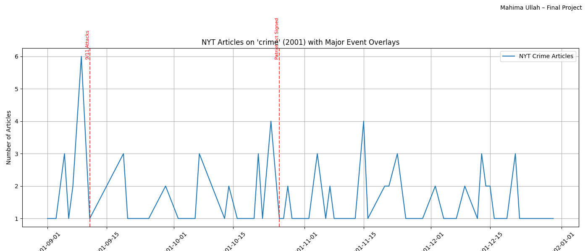

# NYT Crime Coverage ETL Pipeline

An object-oriented ETL pipeline that pulls crime-related coverage from the **New York Times Article
Search API**, deduplicates and normalizes it into a typed dataset, and visualizes daily publication
volume against major 2001 policy events.

**Stack:** Python · requests · pandas · Matplotlib



---

## What it does

```
Extract  →  12 paginated API requests (4 months × 3 pages), throttled to 1 request
            per 12 seconds to stay inside the free tier's rate limit, with per-request
            error handling so a single failed page never aborts the run
Transform →  Deduplicates on canonical article URL, coerces publication dates to
            datetime, flattens the nested JSON response to a 4-field schema
Load      →  Writes a typed CSV and renders an annotated time-series chart
```

**Output:** 119 unique articles spanning **September 1 – December 30, 2001**, across
**75 distinct publication days** and **12 newspaper sections**.

| Field | Source path in the API response |
|---|---|
| `pub_date` | `docs[].pub_date` (truncated to date) |
| `headline` | `docs[].headline.main` |
| `section` | `docs[].section_name` |
| `url` | `docs[].web_url` — also the deduplication key |

## What the data shows

Crime coverage in this window is overwhelmingly local: the **New York** section accounts for 39 of
119 articles (32.8%), with World (36) and U.S. (18) next. The remaining 26 articles scatter across
nine sections including Books, Opinion, Business and Theater — a reminder that a keyword search
returns topical noise (book reviews titled "CRIME") alongside genuine crime reporting, which is
exactly the kind of thing that has to be handled before a keyword-driven dataset can support a
claim.

## Running it

The API key is read from the environment, never hardcoded:

```bash
pip install -r requirements.txt
cp .env.example .env          # then paste your own key into .env
export NYT_API_KEY='your-key-here'
python nyt_crime_etl.py
```

Get a free key at [developer.nytimes.com](https://developer.nytimes.com/). A full run takes about
2.5 minutes, almost all of it deliberate rate-limit sleeping.

## Limitations

**Monthly totals are censored, not measured.** The pipeline requests 3 pages per month and the API
returns 10 articles per page, so any month with more than 30 matching articles is truncated at 30 —
which is exactly what happens here (September returned 29; October, November and December each
returned the full 30). Month-over-month counts therefore reflect the pagination cap, not real
coverage volume, and the day-level series should be read as *a sample of* coverage rather than a
census of it. Lifting the cap and paging until exhaustion would fix this, at the cost of a much
longer run under the rate limit.

The API's default relevance sort compounds this: the 30 articles retrieved for a month are the 30
the API judged most relevant, not a random or chronological sample, so within-month distributions
carry the same caveat. Keyword matching on `"crime"` also has no semantic filter, which is why book
reviews and a theater review appear in the results.

---

*Built for Object-Oriented Programming, Rutgers University. Full written report: `project_report.pdf`*
